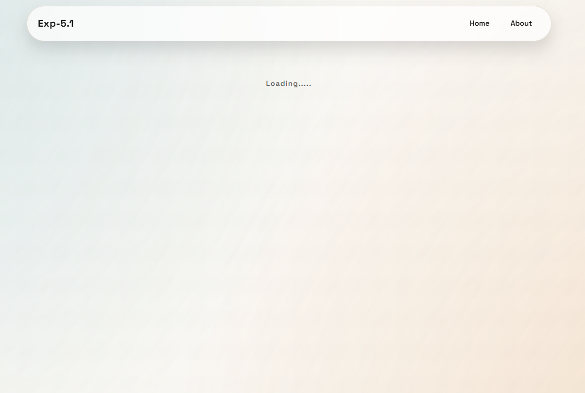
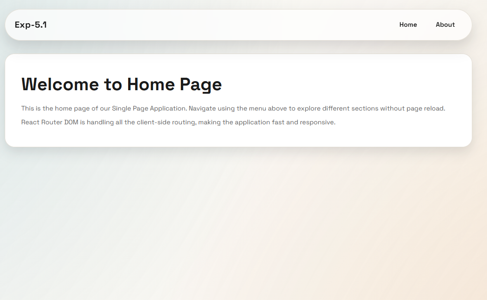
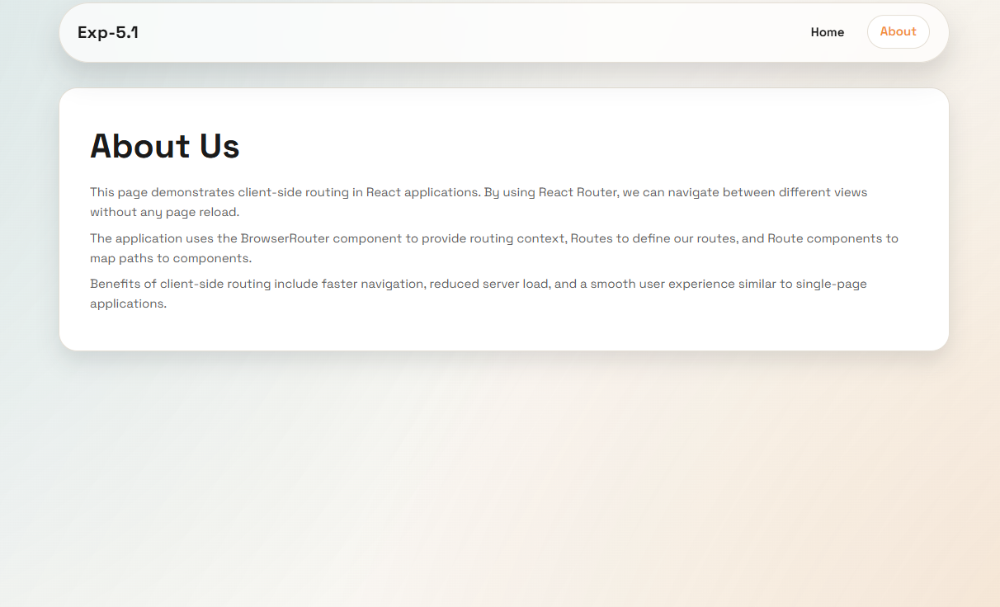
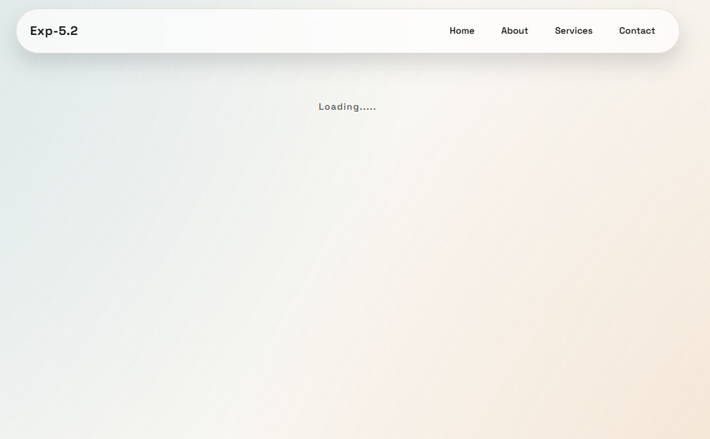
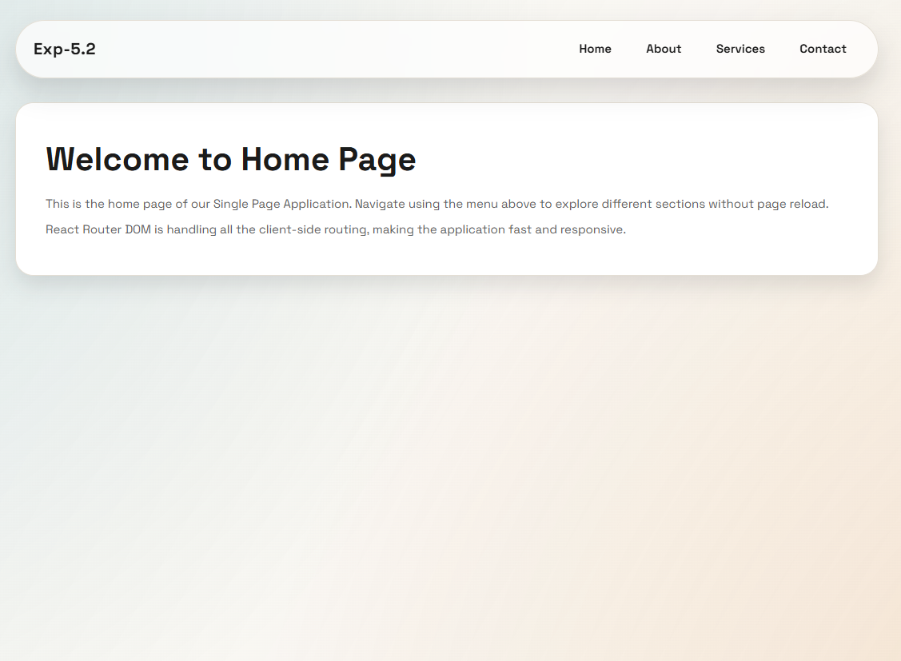
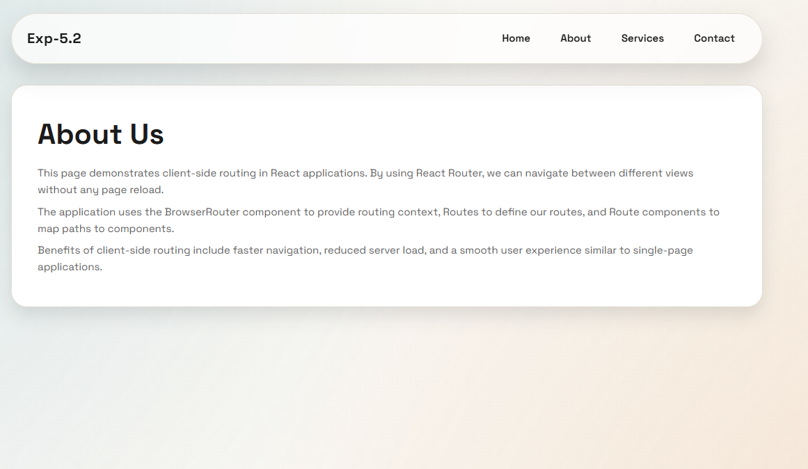
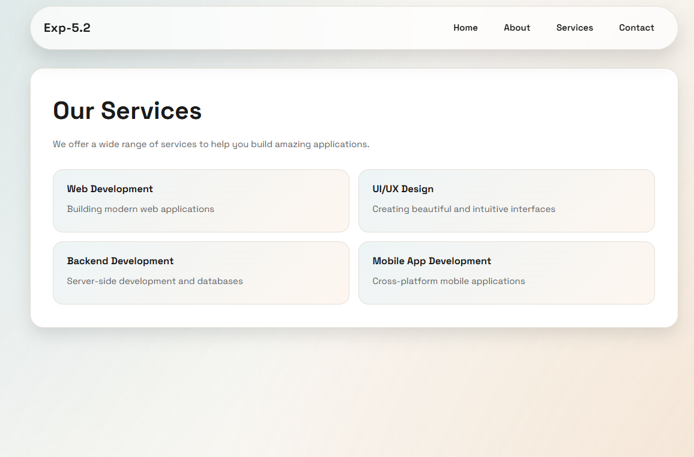
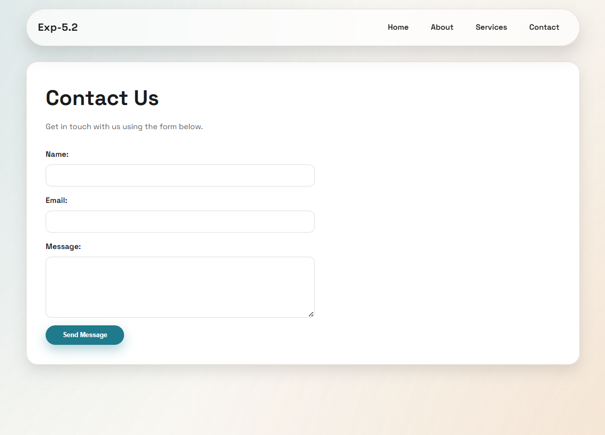

# Exp-5

React-based experiments for routing and context.

# Exp 5.1 - React Router Basics (Lazy Loading)

A simple React SPA that demonstrates client-side routing with React Router and lazy-loaded pages.

# Exp 5.2 - React Router Multi-Page SPA

An extended React SPA that adds Services and Contact pages, showcasing client-side routing, lazy loading, and a simple contact form.

