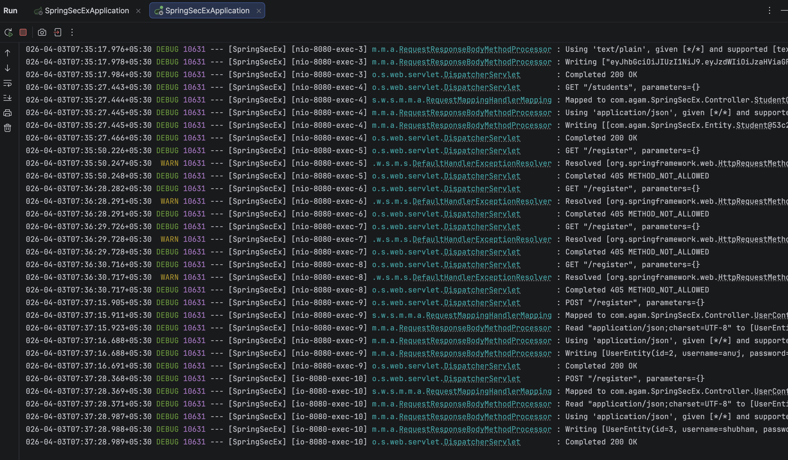

# Experiment 9 – Spring Boot Security with JWT Authentication

A Spring Boot REST API demonstrating stateless authentication using Spring Security and JWT (JSON Web Tokens), with MySQL for user persistence.

## Tech Stack

- Java 25
- Spring Boot 4.x
- Spring Security
- JWT (jjwt 0.13.0)
- Spring Data JPA
- MySQL
- Lombok
- Maven

## Project Structure

```
src/main/java/com/agam/SpringSecEx/
├── config/
│   └── SecurityConfig.java       # Security filter chain, BCrypt, AuthManager
├── Controller/
│   ├── HelloController.java      # Public greeting endpoint
│   ├── StudentController.java    # Protected student endpoints
│   └── UserController.java       # Register & Login endpoints
├── Entity/
│   ├── Student.java
│   ├── UserEntity.java
│   └── UserPrincipal.java
├── Filter/
│   └── JwtFilter.java            # JWT validation filter
├── Repository/
│   └── UserRepository.java
├── Service/
│   ├── JwtService.java           # Token generation & validation
│   ├── MyUserDetailService.java  # UserDetailsService impl
│   └── UserService.java
└── SpringSecExApplication.java
```

## API Endpoints

| Method | Endpoint     | Auth Required | Description              |
|--------|--------------|---------------|--------------------------|
| GET    | `/`          | Yes           | Greeting + session ID    |
| POST   | `/register`  | No            | Register a new user      |
| POST   | `/login`     | No            | Login and receive JWT    |
| GET    | `/students`  | Yes           | Get all students         |
| POST   | `/students`  | Yes           | Add a student            |

## How It Works

1. Register a user via `POST /register`
2. Login via `POST /login` — returns a JWT token
3. Pass the token in the `Authorization: Bearer <token>` header for protected routes

## Sample Requests

**Register**
```json
POST /register
{ "username": "shardul", "password": "pass123" }
```

**Login**
```json
POST /login
{ "username": "shardul", "password": "pass123" }
```
Response: `eyJhbGciOiJIUzI1NiJ9...`

**Get Students** (with JWT)
```
GET /students
Authorization: Bearer <token>
```

## Screenshots

### Register


)

### Login


### Get Students


### Terminal


## Database Configuration

Update `src/main/resources/application.properties`:

```properties
spring.datasource.url=jdbc:mysql://localhost:3306/university
spring.datasource.username=root
spring.datasource.password=your_password
```

## Running the App

```bash
mvn spring-boot:run
```

Server starts at `http://localhost:8080`
